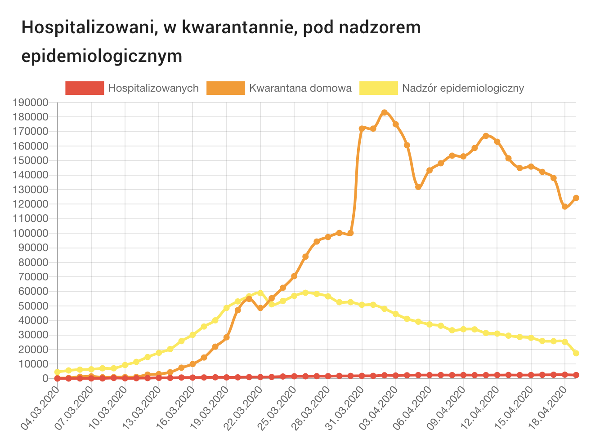

# covis

The covid19 pandemic has led to an increased interest in various forms of data visualisation. In this repository I collect good and bad, simple and complex approaches to covid19-related data visualization.

## Gazeta.pl

Source: https://wiadomosci.gazeta.pl/wiadomosci/14,166794,25831864.html

## koronawirus-w-polsce.pl

